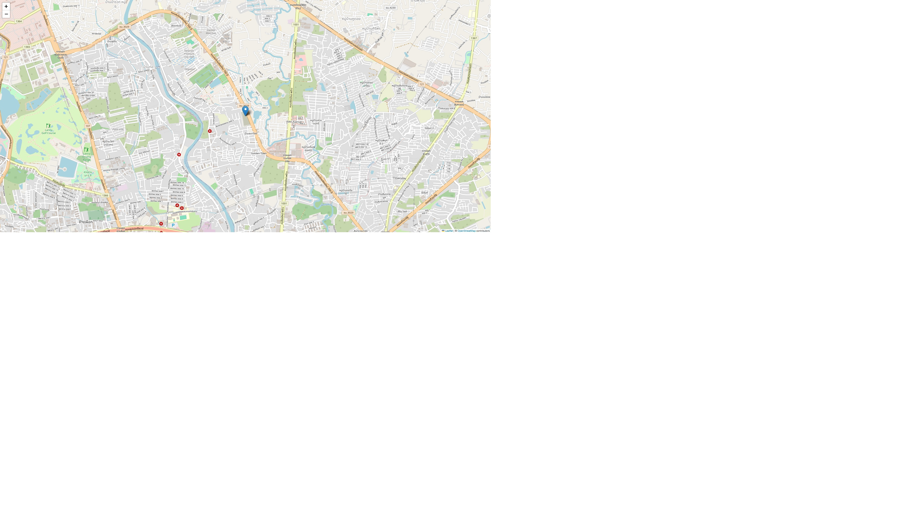

# SAR System

This project is part of Independent Study that uses YOLO for object detection and geolocation.

## Features
- Detect objects in images using YOLO.
- Calculate geolocation using drone metadata.
- Generate maps with detected objects.

## Installation
1. Clone the repository:
   ```bash
   git clone https://github.com/kridsanaphon-suksan/SAR-System.git

## Example Input

Below is an example of the system's input:


## Example Output

Below is an example of the system's output:


## Example Output of HTML

Below is an example of the system's html output:



